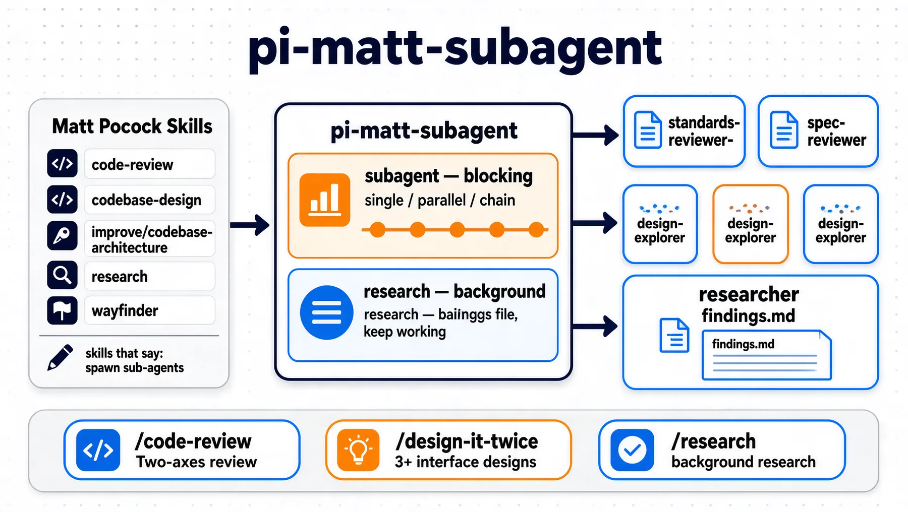

<div align="center">
  <h1 id="pi-matt-subagent">pi-matt-subagent</h1>
  
  简体中文: [README.zh-CN.md](README.zh-CN.md)
  
  
</div>

A [pi](https://github.com/earendil-works/pi) plugin that turns the subagent instructions in [Matt Pocock's skills](https://github.com/mattpocock) into real tool calls. When a skill says *"spawn sub-agents in parallel"* or *"fire the research subagents"*, this plugin is the execution layer — it starts real pi subagents (separate subprocesses, or an in-process session for background work), waits for them, and hands you their results.

> [!WARNING]
> This plugin registers a tool named `subagent`; similar subagents extensions do too. Don't run them side by side — install one or the other, never both.

## Features

- **Two tools, two semantics** — `subagent` (blocking) and `research` (background), matching exactly what the upstream skills ask for.
- **Blocking subagents** — single, parallel, or chained agents run in separate subprocesses; results come back in one tool result, with a `{previous}` placeholder for chain handoffs.
- **Background research** — an in-process second session writes cited findings to a file while you keep working; the completion state (`succeeded` / `failed` / `terminated` / `aborted`) is pushed into your context — no polling.
- **Six bundled roles** — `standards-reviewer`, `spec-reviewer`, `design-explorer`, `architecture-scout`, `researcher`, `fact-finder` — the same jobs the skills describe.
- **Four slash commands** — `/code-review <ref>`, `/design-it-twice <candidate>`, `/research <question>`, and `/subagents` for run management.
- **Per-run overrides** — pin one run's model via the public `model` field; thinking effort is deterministic (per-task > per-call override > per-role customization > config default > role preset > inherited-minus-one), with the `set-thinking-level` tool as the only model-visible channel for changing it.
- **Live run management** — a footer counter (`⧗ N subagents running`); `/subagents` to follow, stop, or inspect runs.

## Install

```sh
pi install npm:pi-matt-subagent
```

Or from a local checkout:

```sh
pi install <path-to-this-repo>
```

Both install the extension and the prompt templates (`/code-review`, `/design-it-twice`, `/research`; `/subagents` ships with the extension). Verify with `pi list`; the prompts appear in the TUI's `/` completion.

## Quick start

Everything here is model-facing — you describe the job, the main agent makes the call.

- **Review your last commit** — `/code-review HEAD~1` runs the Standards and Spec axes as two parallel blocking subagents and reports them side by side.
- **Research while you keep working** — `/research "verify the claim that …"` returns immediately; the findings path is pushed to you when the run finishes.
- **Call the tools directly** — say "run a `subagent` review of `src/lib.ts` with `standards-reviewer`", or "start a `research` on ADR 0013 and write findings to `docs/research-0013.md`".

## The two tools

| Tool | Semantics | What it does |
| --- | --- | --- |
| `subagent` | **blocking** | Runs single / parallel / chain subagents. Does not return until every subagent finishes; full results come back in one tool result. `chain` supports a `{previous}` placeholder that passes one step's output into the next. |
| `research` | **background** | Runs an in-process second session that writes cited findings to a file, returns immediately, and pushes the completion into your context — no polling. |
| `set-thinking-level` | **session** | Sets the main session's thinking level for the rest of the session (upstream `pi.setThinkingLevel`, session-scoped, never persisted; a fresh session starts from your global default). The only model-visible channel for changing thinking effort — call it only when the user explicitly asks for a different depth. |

Both accept an optional `input` field: a JSON object string carrying the parameters still hidden from the public schema (`thinkingOverride` for `subagent`; `maxWallClockMs` for `research`, a wall-clock cap that may only tighten the 60-minute default). The per-run `model` override is a **public field** on both tools (ADR 0022 — a hidden channel proved unreliable: models dropped it and the run silently fell back to the configured default).

Direct fields override same-name JSON keys; invalid JSON raises a clear model-visible error, and the merged parameters are validated against the full contract before dispatch.

```json
{
  "task": "review the diff since HEAD~1 for standards compliance",
  "agent": "standards-reviewer",
  "model": "sensenova/sensenova-6.8-flash-lite"
}
```

Thinking effort is not a parameter: every run resolves it through the decision hierarchy (per-task > per-call override > per-role customization > config default > role preset > inherited-minus-one, then the model-capability clamp), or the model applies an explicit instruction via `set-thinking-level`. A legacy call that still passes `thinkingLevel` fails loudly with an unknown-parameter error.

Model names resolve against your `~/.pi/agent/models.json` registry as `provider/id`; an unresolvable name fails loudly and the run never starts.

## The four slash commands

- **`/code-review <ref>`** — two-axis review (Standards + Spec) of the diff since `<ref>`, run as two parallel blocking subagents.
- **`/design-it-twice <candidate>`** — generate 3–4 radically different interface designs for one deepening candidate as parallel blocking subagents, then compare by depth, locality, and seam placement.
- **`/research <question>`** — start a background researcher against primary sources and keep working; the completion is pushed to you with the findings path.
- **`/subagents`** — overview and management of every run: follow progress, stop a runaway researcher, clear finished records, read a run's log (`kill`, `tail`, `prune`, `snapshot`).

## Roles and dispatch

Six bundled roles come with the plugin. User agents from `~/.pi/agent/agents/` and project agents from `.pi/agents/` override bundled roles by name (project agents sit behind a trust confirmation).

Thinking effort resolves deterministically through two orthogonal layers. The decision-source hierarchy is **per-task/per-step `thinkingLevel` > per-call override (`input.thinkingOverride`) > `roleDefaults` per-role tier > config default (`dispatchDefaultThinkingLevel`) > role preset > inherited-minus-one** (the main-session level, strictly one tier down in `off < minimal < low < medium < high < xhigh < max`; `off` stays `off`). The result then passes through the target model's capability clamp (`clampThinkingLevel`, upward-first) — requested vs effective are both recorded, and a clamp shows as `high (req: xhigh)`. The public `thinkingLevel` parameter is gone (it was the randomness source); the only model-visible channel for changing effort is the `set-thinking-level` tool, called only when the user explicitly asks for a different depth. Model-pinned roles skip only the inherited-minus-one layer.

## Configuration

Behavioral knobs live in a lazily-created file at `~/.pi/agent/extensions/matt-subagent.json`. Loading never writes it — the file appears only when you `set` or `reset` — and deleting it restores all defaults. Values apply to the next run without `/reload`.

| Key | Default | Effect |
| --- | --- | --- |
| `maxTasksPerCall` | 8 | Caps tasks per call — parallel tasks **and** chain steps; over the cap the call is refused |
| `maxConcurrency` | 4 | Max in-flight subagent processes in parallel mode |
| `perTaskOutputCap` | 50 KiB | Byte cap for one task's summary output in parallel aggregation |
| `researchWallClockMs` | 45 min | Default background-research wall-clock cap, and the hard ceiling for `input.maxWallClockMs` (an existing explicit value overrides the new default; reset the key to pick up 45) |
| `researchChildExtensions` | (curated) | npm packages loaded into a research child: default `npm:@ssk_dev/pi-web-access-lean` + `npm:@upstash/context7-pi`; only an explicit empty array disables extensions |
| `logTailBytes` | 4096 | Byte cap for `/subagents tail` log reads |
| `dispatchDefaultModel` | (inherit) | Default `provider/id` when neither the call nor the role specifies one |
| `dispatchDefaultThinkingLevel` | (inherit) | Default thinking level above the role preset (issue #39 — live for the six embedded roles, no longer dead config); absent → inherited-minus-one |
| `roleDefaults` | (inherit) | Per-role dispatch customization: `{ "<role>": { model?, thinkingLevel? } }`. `roleDefaults.<role>.thinkingLevel` beats the config default and the role's own preset; `roleDefaults.<role>.model` beats the config default model. Edit via dotted keys: `config set roleDefaults.standards-reviewer.thinkingLevel low` |

Drive it from `/subagents config`:

```
/subagents config set maxConcurrency 6
/subagents config set dispatchDefaultThinkingLevel low
/subagents config set roleDefaults.standards-reviewer.thinkingLevel low
/subagents config set roleDefaults.researcher.model openai/gpt-x
/subagents config reset roleDefaults.standards-reviewer.thinkingLevel
/subagents config reset maxConcurrency
/subagents config reset
```

`set` writes the effective value to the file; `reset` removes one key (back to that knob's default) or the whole file. Dotted `roleDefaults.<role>.<field>` keys edit the nested knob; resetting a dotted key removes just that field (an emptied role prunes itself). Invalid entries degrade that key to its default and are flagged `[degraded]` in the config view.

## Research child extensions (trust surface)

A background research child starts with **only built-in tools plus the approved query packages** — never the main session's full extension set. The default loadout is `npm:@ssk_dev/pi-web-access-lean` (web search/page fetch) and `npm:@upstash/context7-pi` (library docs), which the researcher role declares as `web_access`, `query-docs`, `resolve-library-id`.

This list is a **curated trust surface, not a promise that every query-style tool is default**. A package qualifies for the default list only when it is read-only, has no external write side effects, has low and explicit external cost, and serves primary-source retrieval.

**Maintaining the list per-machine** (no code changes):

- **Extend/override** — add packages to `researchChildExtensions` (JSON array in `~/.pi/agent/extensions/matt-subagent.json`, or a comma list via `/subagents config set researchChildExtensions npm:x,npm:y`). Remember step 2 below: a loaded package is only visible to the researcher once its tools are also declared on the role.
- **Disable entirely** — set `researchChildExtensions` to `[]` in the JSON file (the config-set CLI cannot express an empty list): the child then loads no extensions at all (network fully off, built-ins only).
- **Finer control** — override the built-in researcher role with a user agent at `~/.pi/agent/agents/researcher.md` (frontmatter `tools:` + body; same-name overrides win, and the runner still appends the findings path / wall-clock / checkpoint rules), to pin exactly which tools are declared.

**Adding a new query tool — the two steps.** (1) *Load*: put its package in `researchChildExtensions`. (2) *Expose*: declare the tool name on the researcher role (the built-in list, or your custom `researcher.md`). Missing either half is a drift.

**Error shapes and remedies.** When a declared tool cannot be loaded (package not installed, knob-disabled, or platform-impossible — e.g. `powershell` off-Windows), the run still starts but the tool is absent from the child, the research tool's returned text and the run log carry a `⚠ Declared but not loaded: …` drift note, and the researcher prompt only lists tools it actually has. The symptom of ignoring the note: the researcher model guesses tool names and loops. Fix by installing the package, pointing the knob at it, or removing the tool from the role.

**Reading a research run's log — what each line means.** The per-run log (`logPath`, tail via `/subagents tail <id>`) mixes four kinds of content; only one of them is the run's outcome:

| Line | Source | It says | It does NOT say |
|---|---|---|---|
| `[loadout] ok/warn …` | loadout self-check (first lines) | whether the knob packages' tools were **loaded** | run success/failure |
| `[run] HH:MM:SS …` | stage lines (`session created`, `prompt started`, `terminal: <status>`) | what the run is **doing now** | — |
| model text | researcher output | research **progress** | — |
| research-status push | terminal push card | the run's **authoritative outcome** (`succeeded` / `failed` / `terminated` / `aborted`) | — |

A loadout line is a loadout status, never a run status: the researcher still runs, and the `terminal:` stage line (or the push card) is the outcome to judge by. Healthy signals: the push card arrives with `succeeded`, the findings file is written, and the log keeps growing. Trouble signals: the run stays `running` with no new log lines for a long stretch (the wall-clock cap then resolves it `terminated`), or the push card reports `failed`/`aborted`. Every executed tool call is also audited to `toolcalls.jsonl` next to the log — the ground truth for what actually ran.

## Project layout

```
extensions/subagent.ts         pi extension: registers the three tools, the run-registry UI,
                               and the in-process research child-session factory
src/lib.ts                     pure logic — roles, tool schemas (single source of truth),
                               input merge/validation, tool-name resolution, the research
                               runner, run-registry bookkeeping; zero pi-runtime imports
src/blocking-protocol.ts       pure blocking-child protocol: JSON-lines stdout accumulation,
                               usage tracking, escalating-kill abort path
src/blocking-runner.ts         pure blocking orchestration — single / parallel / chain plans
src/*.test.ts                  unit tests (node --test, no pi runtime)
scripts/                       token benchmark + e2e scripts (dev-only)
prompts/                       the three slash-command templates
docs/adr/                      19 recorded decisions (dual channel, research redesign,
                               config surface, usage line, …)
GLOSSARY.md                    domain glossary (subagent, role, blocking, background, push, …)
```

## Development

```sh
npm test          # unit tests, no pi runtime needed
npm run typecheck # extension + lib + scripts typecheck
```

The extension is a thin consumer of `src/lib.ts`; the pure functions there (dispatch-arg assembly, tool resolution, `input` merge/validation, the surface contract) are what the tests cover. Real-pi e2e scripts (`scripts/push-e2e.ts`, `scripts/blocking-e2e.ts`) cover the process wiring that unit tests can't reach; `node scripts/benchmark-tools.ts` measures the tool surface's token contribution (~482 / ~398 / ~104 tokens for `subagent` / `research` / `set-thinking-level`), guarded by a regression test in the suite. `node scripts/apply-skill-patch.ts` re-applies the ADR 0013 patch texts to the installed skills after a mattpocock upstream sync.
