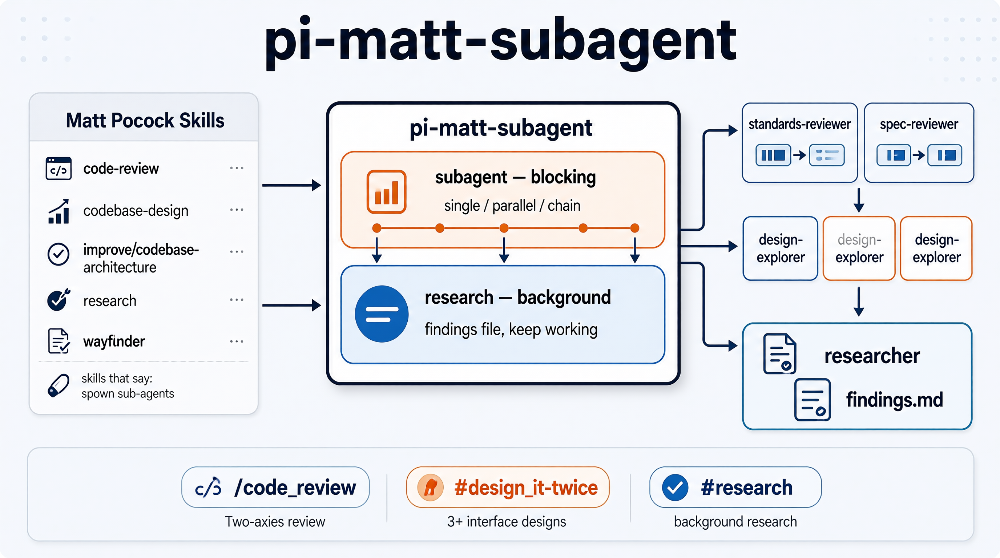

# pi-matt-subagent

> 简体中文: [README.zh-CN.md](README.zh-CN.md)

<p align="center">
  
</p>

A pi plugin that makes the subagent instructions in [Matt Pocock's skills](https://github.com/mattpocock) actually run. When a skill says *"spawn sub-agents in parallel"* or *"fire the research subagents"*, this plugin is the execution layer: it starts real pi subagents — separate subprocesses for blocking runs, an in-process second session for background research (ADR 0013) — waits for them (or not, in the background case), and hands you their results.

Built as a dogfooding case study: the plugin exists because the upstream skills demanded it, and its two tools map one-to-one onto the sub-agent patterns those skills describe.

## Why it exists

Matt Pocock's skills call for sub-agents all over the place, but don't say how. Read the skills and you'll find the same request repeated:

- **`code-review`** — run the Standards and Spec axes as *parallel sub-agents* so they don't pollute each other's context.
- **`codebase-design`** (`DESIGN-IT-TWICE.md`) — spawn 3+ sub-agents, each producing a *radically different* interface for the same module.
- **`improve-codebase-architecture`** — a sub-agent walks the codebase and reports architectural friction; the final step is the design-it-twice pattern above.
- **`research`** / **`wayfinder`** — spin up a *background* agent that reads primary sources and writes findings to a file while the main session keeps working.

This plugin turns those sentences into tool calls. The roles it bundles are the same jobs the skills describe (standards-reviewer, spec-reviewer, design-explorer, architecture-scout, researcher, fact-finder), so the vocabulary carries over unchanged.

## What you get

Two tools, matching the two semantics the upstream skills need:

| Tool | Semantics | What it does |
|---|---|---|
| `subagent` | **blocking** | Runs single / parallel / chain subagents. Does not return until every subagent finishes; full results come back in one tool result. `chain` supports a `{previous}` placeholder that passes one step's output into the next. |
| `research` | **background** | Runs an in-process second session (ADR 0013) that writes cited findings to a file, returns immediately with a handle, and pushes the completion (succeeded / failed / terminated / aborted) into your context — no polling. |

Six bundled roles: `standards-reviewer`, `spec-reviewer`, `design-explorer`, `architecture-scout`, `researcher`, `fact-finder`. User agents from `~/.pi/agent/agents/` and project agents from `.pi/agents/` override bundled roles by name; project agents sit behind a trust confirmation.

Both tools accept an optional `input` field: a JSON object string carrying advanced parameters the public schema hides — `subagent` accepts `model` (per-run model override) and `thinkingOverride` (per-run thinking level), `research` accepts `model` and `maxWallClockMs` (a hidden wall-clock cap that may only tighten the 60-minute default). Direct fields override same-name JSON keys; invalid JSON or a non-object value raises a clear model-visible error, and the merged parameters are validated against the full contract before dispatch (ADR 0011).

> **Coexistence**: this plugin registers a tool named `subagent`; similar subagents extensions do too. Avoid running this plugin alongside other subagents extensions — same tool names collide, so install one or the other, never both (ADR 0012).

Every run shows in a footer counter (`⧗ N subagents running`), including blocking runs. `/subagents` lists the full snapshot and manages runs: with no args it opens a menu (view runs / stop run / clear finished / show log); with args it runs `kill <id>`, `tail <id>`, `prune`, or `snapshot` directly. Stopping a background research run aborts its in-process child session and records the run as `aborted` (the outcome is pushed like every terminal state), never `failed` or `terminated`. Each `research` run is bounded by a single wall-clock cap (default 60 minutes; tighten per call via hidden `maxWallClockMs`): findings are checkpointed before each search round, so a cap kill loses at most one round of work; a wall-clock kill appends a slim `research-terminated` marker to the findings file and records the run as `terminated`. Blocking runs can only be interrupted with Esc, which aborts the whole call; commands queue until it finishes. Every blocking usage line — inline in a `subagent` tool result and as the `usage:` line of a `/subagents` row — ends with the dispatched model and its thinking level in pi's footer style (`(sensenova) deepseek-flash • high`); `off` renders as `thinking off`, and a run that pinned no level renders as `default` (the value is the resolved dispatch intent, not the child's effective tier — ADR 0015).

Four slash commands — the first three are direct entries into one upstream pattern each:

- **`/code-review <ref>`** — two-axis review (Standards + Spec) of the diff since `<ref>`, run as two parallel blocking subagents. Use it to review a commit, branch, or merge-base. Maps to the `code-review` skill.
- **`/design-it-twice <candidate>`** — generate 3-4 radically different interface designs for one deepening candidate as parallel blocking subagents, then compare by depth, locality, and seam placement. Maps to `codebase-design`'s DESIGN-IT-TWICE pattern (the final step of `improve-codebase-architecture`).
- **`/research <question>`** — start a background researcher against primary sources and keep working; the completion (succeeded / failed / terminated / aborted) is pushed to you with the findings path. Maps to the `research` skill (and `wayfinder`'s research tickets).
- **`/subagents`** — overview and management of every run: follow progress, stop a runaway researcher (aborts the in-process child), clear finished records, read a background run's log.

## Install

From npm:

```sh
pi install npm:pi-matt-subagent
```

Or from a local checkout:

```sh
pi install <path-to-this-repo>
```

Both install the extension (the two tools) and the prompt templates (three of the four slash commands — `/code-review`, `/design-it-twice`, `/research`; `/subagents` ships in the extension itself). Verify with `pi list`; the prompts appear in the TUI's `/` completion.

## Quick start

Everything here is model-facing: you describe the job and the main agent makes the call.

- **Review your last commit** — `/code-review HEAD~1` runs the Standards and Spec axes as two parallel blocking subagents and reports them side by side.
- **Research in the background while you keep working** — `/research "verify the claim that …"` returns a handle immediately; the findings path is pushed to you when the run finishes.
- **Call the tools directly** — say "run a `subagent` review of `src/lib.ts` with `standards-reviewer`" or "start a `research` on ADR 0013 and write findings to `docs/research-0013.md`".

### Use a different model per run

Both tools default to the main session's model, and both accept per-run overrides through the hidden `input` field:

| Tool | Hidden `input` keys | Effect |
| --- | --- | --- |
| `subagent` | `model`, `thinkingOverride` | Model (`provider/id`) and thinking level for this run |
| `research` | `model`, `maxWallClockMs` | Model override; wall-clock cap — tighten-only, default 60 minutes |

You don't write `input` by hand — just say "run that review with `deepseek-v4-pro`" or "research this with a 30-second cap" and the main agent carries the override in the tool call. Directly, one call looks like:

```json
{
  "task": "review the diff since HEAD~1 for standards compliance",
  "agent": "standards-reviewer",
  "input": "{\"model\": \"sensenova/deepseek-v4-pro\", \"thinkingOverride\": \"high\"}"
}
```

Model names resolve against your `~/.pi/agent/models.json` registry as `provider/id`; an unresolvable name fails loudly at the tool layer and the run never starts. Direct fields beat same-name JSON keys, and the merged result is validated against the full contract before dispatch (ADR 0011).

## Configuration (ADR 0018)

The extension's behavioral knobs are user-configurable through a lazily-created file at `~/.pi/agent/extensions/matt-subagent.json`. Loading never writes it — the file appears only when you `set` or `reset` — and deleting it restores all defaults. Values apply to the next run without `/reload`.

The knobs and their built-in defaults:

| Key | Default | Effect |
| --- | --- | --- |
| `maxTasksPerCall` | 8 | Caps tasks per call — parallel tasks **and** chain steps; over the cap the call is refused |
| `maxConcurrency` | 4 | Max in-flight subagent processes in parallel mode |
| `perTaskOutputCap` | 50 KiB | Byte cap for one task's summary output in parallel aggregation |
| `researchWallClockMs` | 60 min | Default background-research wall-clock cap, and the hard ceiling for `input.maxWallClockMs` |
| `logTailBytes` | 4096 | Byte cap for `/subagents tail` log reads |
| `dispatchDefaultModel` | (inherit) | Default `provider/id` when neither the call nor the role specifies one |
| `dispatchDefaultThinkingLevel` | (inherit) | Default thinking level when neither the call nor the role specifies one |

Read `dispatchDefaultModel`/`dispatchDefaultThinkingLevel` show `(inherit)` — the main session's model/level — until overridden. Dispatch precedence is: per-call override > role declaration > config default > main-session inheritance. A role that pins its own model is not exempt from *explicit* levels — for it only the inherited layer is skipped. Before dispatch, the requested level is pre-clamped to the target model's capability (same clamp the child applies); a run records both the requested and effective levels, and the usage line annotates the difference when they diverge (`high (req: xhigh)`).

Drive it from the `/subagents` command (also under the menu's "Settings…" entry). The command argument-completes verbs, config keys, thinking levels, run ids, and — for `dispatchDefaultModel` — only the models from `~/.pi/agent/models.json` whose provider has working credentials; the menu's model picker lists the same registry instead of asking for free text:

```
/subagents config
/subagents config set maxConcurrency 6
/subagents config set dispatchDefaultThinkingLevel low
/subagents config set dispatchDefaultModel inherit
/subagents config reset maxConcurrency
/subagents config reset
```

A `set` writes the effective values to the file; `reset` removes one key (`config reset <key>` — back to that knob's default or `(inherit)`) or the whole file (`config reset`). The two optional dispatch knobs are omitted (not `null`) when they're left to inherit the main session. Invalid entries — bad JSON, unknown keys, wrong types, `≤0` where a positive bound applies, an unknown thinking level, an empty model string — degrade that key to its default and are flagged `[degraded]` in the config view, so a typo can't stall a session. Deleting the file is a full reset.

## Project layout

```
extensions/subagent.ts   pi extension: registers the subagent + research tools and the
                         in-process research child-session factory (ADR 0013)
src/lib.ts               pure logic — role definitions, tool schemas (single source of truth),
                         input merge/validation, tool-name resolution, dispatch args, the
                         research runner (child-session factory seam); zero pi-runtime
                         imports, tested with node --test
src/lib.test.ts          unit tests
scripts/                 token benchmark (Seam E) + measurement extension + push-e2e / blocking-e2e scripts (dev-only)
prompts/                 the four slash-command templates
docs/adr/                decisions: dual channel, tool-name resolution, research redesign (push
                         delivery, wall-clock cap), run registry + management, input escape
                         hatch, coexistence stance, usage-line model + thinking level
GLOSSARY.md             domain glossary (subagent, role, blocking, background, push, ...)
```

Two decisions worth knowing about:

- **Tool-name resolution** (`docs/adr/0002`): a role's declared tools are resolved against the current environment's registry before dispatch. Names the environment lacks fall back to built-ins (`ffgrep` → `grep`), and unresolvable names are dropped instead of silently breaking the child process. Handles fff mode changes without coupling to fff itself.
- **Dual channel** (`docs/adr/0001`): blocking is the default mental model; only `research`/`wayfinder` use the background channel.
- **Research redesign** (`docs/adr/0013`): the background researcher runs as an in-process second session; every terminal state is pushed into the main context; the budget machinery collapsed to one wall-clock cap + checkpointed findings.
- **`input` escape hatch** (`docs/adr/0011`): advanced per-run parameters (`model`, `thinkingOverride`) go through the `input` JSON field — direct fields win over JSON keys, invalid input fails loudly, and the merged object is validated against the full contract before dispatch. The parameter schemas live in `src/lib.ts` as the single source of truth.
- **Usage line model + thinking level** (`docs/adr/0015`): the per-run usage line ends with the dispatched model and its thinking tier in pi's footer style; the shown tier is the resolved dispatch intent (the child's effective level is not observable), and an unpinned run is labelled `default`.

## Token benchmark

With only this extension enabled, its recurring model-facing initialization contribution is:

| Tool | Contribution | Tokens |
| --- | --- | ---: |
| `subagent` | description + parameter schema | **630** |
| `research` | description + parameter schema | **517** |

Measured with pi 0.87.0 on 2026-09-22 in a separate temporary process with an empty working directory and configuration (no other extensions, skills, context files, or slash commands; `before_agent_start` surface). Tokens are a fixed character-proxy estimate (`ceil(chars / 4)`), not a provider tokenizer billing. Reproduce with `node scripts/benchmark-tools.ts`; `npm test` asserts the serialized surface stays within baseline × 1.2 (token regression guard), so footprint creep is caught by the suite.

## Development

```sh
npm test          # unit tests, no pi runtime needed — src/lib.ts stays runtime-free
npm run typecheck # extension + lib + scripts typecheck (tsconfig.json, requires installed pi packages)
```

The extension is a thin consumer of `src/lib.ts`; the pure functions there (dispatch-arg assembly, tool resolution, background spawn with injectable seams, `input` merge/validation, the surface contract) are what the tests cover. `node scripts/benchmark-tools.ts` refreshes the token-benchmark numbers and the guard baseline when the registered surface changes.

### Real-pi e2e scripts (dev-only, need a working model/API key)

```sh
pi -p --no-session --no-extensions -e extensions/subagent.ts -e scripts/push-e2e.ts \
  "Count slowly from 1 to 25, one number per line, then say done"   # research wiring: spawn, push, crash isolation, shutdown cleanup
pi -p --no-session --no-extensions -e extensions/subagent.ts -e scripts/blocking-e2e.ts \
  "Count slowly from 1 to 25, one number per line, then say done"   # blocking spawn rewiring: protocol + usage, dispose-on-close
```

Each appends its gates to `push-e2e.log` / `blocking-e2e.log` in the OS temp dir; look for `PUSH-E2E OK` / `BLOCKING-E2E OK` per gate. Not part of `npm test` (Path-1 stance: the pure seams are covered by `node --test`; real-pi wiring regressions are caught by these scripts instead of a fake-pi harness).

`blocking-e2e.ts` is the blocking channel's counterpart to `push-e2e.ts`: the unit tests pin the pure semantics (protocol accumulation rules, SIGTERM→SIGKILL backstop timing) with fake runners and fake timers, while this script pins the real-process wiring those tests cannot reach — the exact spawn seams `runSingleAgent` uses. Gate 1 spawns a real pi child and drives the full `getPiInvocation → spawn → accumulator → result` path, asserting exitCode 0, parsed messages, and usage > 0. Gate 2 SIGTERMs a long-running child mid-flight via `escalateKill` (the Esc-abort path minus the TUI) and asserts it closes within the grace window — i.e. by SIGTERM, not the SIGKILL backstop — then verifies close→dispose cancels the backstop. Windows caveat: a process cannot trap SIGTERM (TerminateProcess), so on Windows gate 2 proves the dispose-on-close path with real signals and timers; the "backstop fires on a SIGTERM-ignoring process" semantics is pinned by the fake-timer unit tests instead.

### Re-applying the skill patches after an upstream sync

The installed skills track mattpocock upstream, and a sync overwrites the ADR 0013 patch texts in `research/SKILL.md` and `wayfinder/SKILL.md` (the texts live in `docs/design/research-redesign/`). After each sync run:

```sh
node scripts/apply-skill-patch.ts                 # re-apply to ~/.pi/agent/skills
node scripts/apply-skill-patch.ts --skills-dir X  # custom skills dir
node scripts/apply-skill-patch.ts --dry-run       # preview only
```

The script re-applies both patches straight from the design docs, idempotently (an already-patched target is a no-op, CRLF-safe), all-or-nothing on missing targets (any missing file means the sync hasn't run — nothing is touched, exit 1), and reports argument errors with a usage hint instead of a stack trace.
