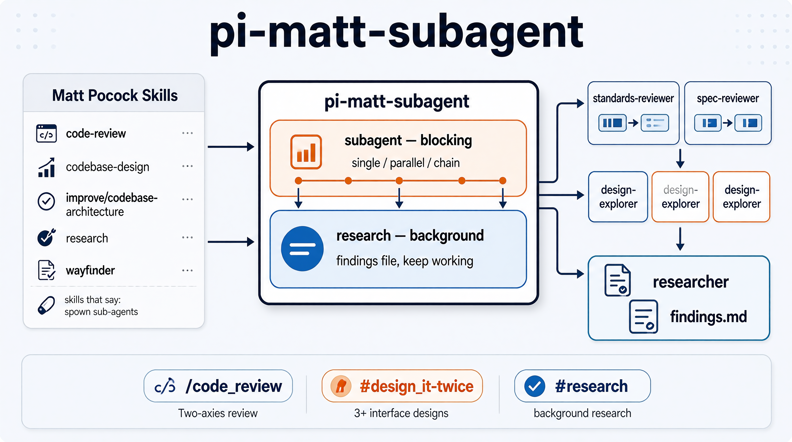

# pi-matt-subagent

> English: [README.md](README.md)

<p align="center">
  
</p>

一个 pi 插件，负责把 [Matt Pocock 的 skills](https://github.com/mattpocock) 里「spawn sub-agents」这类指令变成真实可跑的动作。当某个 skill 写着 *"spawn sub-agents in parallel"* 或 *"fire the research subagents"* 时，这个插件就是执行层：它启动真正的 pi 子进程，阻塞等待（后台场景则不等待），然后把结果交回给你。

这个插件本身就是 dogfooding 的产物：上游 skills 有子代理需求，插件才存在。它的两个工具与这些 skill 描述的子代理模式一一对应。

## 为什么会有这个插件

Matt Pocock 的 skills 到处都在要求子代理，却没说明 pi 里具体怎么做。翻一遍就会发现同样的话反复出现：

- **`code-review`** —— Standards 和 Spec 两轴要作为 *并行子代理* 运行，互不污染上下文。
- **`codebase-design`**（`DESIGN-IT-TWICE.md`）—— 派生 3+ 个子代理，各自为同一个模块设计 *截然不同* 的接口。
- **`improve-codebase-architecture`** —— 子代理走查代码库并报告架构摩擦；最后一步就是上面的 design-it-twice。
- **`research`** / **`wayfinder`** —— 起一个 *后台* 代理读一手资料，把结论写进文件，主会话继续干活。

这个插件把这几句话变成工具调用。它内置的角色与这些 skill 描述的任务同名（standards-reviewer、spec-reviewer、design-explorer、architecture-scout、researcher、fact-finder），词汇原样沿用。

## 装了什么

两个工具，对应上游 skills 需要的两种语义：

| 工具 | 语义 | 做什么 |
|---|---|---|
| `subagent` | **blocking** | 运行 single / parallel / chain 子代理。所有子代理跑完才返回，完整结果一次拿回。`chain` 支持 `{previous}` 占位符，把上一步输出传给下一步。 |
| `research` | **background** | 派生一个分离的研究者进程，把带引用的结论写进文件，立即返回 handle，主代理稍后读文件。 |

六个内置角色：`standards-reviewer`、`spec-reviewer`、`design-explorer`、`architecture-scout`、`researcher`、`fact-finder`。`~/.pi/agent/agents/` 下的用户代理和 `.pi/agents/` 下的项目代理按名字覆盖内置角色；项目代理需要信任确认。

三个 slash command，每个直通一个上游模式：

- **`/code-review <ref>`** —— 对 `<ref>` 以来的 diff 做两轴审查（Standards + Spec），两个并行 blocking 子代理。适合审一个 commit、分支或 merge-base。对应 `code-review` skill。
- **`/design-it-twice <candidate>`** —— 为一个深化候选并行生成 3-4 个差异显著的接口设计，再从深度、局部性、接缝位置比较。对应 `codebase-design` 的 DESIGN-IT-TWICE 模式（也是 `improve-codebase-architecture` 的最后一步）。
- **`/research <question>`** —— 起一个后台研究者查一手资料，主会话继续干活，稍后读 findings 文件。对应 `research` skill（以及 `wayfinder` 的 research 工单）。

## 安装

从 npm 安装：

```sh
pi install npm:pi-matt-subagent
```

或从本地仓库安装：

```sh
pi install <本仓库路径>
```

两种方式都会安装扩展（两个工具）和 prompts（三个 slash command）。用 `pi list` 确认；prompts 会出现在 TUI 的 `/` 补全里。

## 项目结构

```
extensions/subagent.ts   pi 扩展：注册 subagent + research 两个工具
src/lib.ts               纯逻辑——角色定义、工具名解析、派发参数、后台 spawn；
                         零 pi 运行时依赖，用 node --test 测
src/lib.test.ts          单元测试（39 个，全绿）
prompts/                 三个 slash command 模板
docs/adr/                决策记录：blocking+background 双通道、工具名归一化
CONTEXT.md               领域词汇表（subagent、role、blocking、background……）
```

两个值得知道的决策：

- **工具名归一化**（`docs/adr/0002`）：角色声明的工具在派发前会对照当前环境的注册表解析。环境里没有的名字回退到内置名（`ffgrep` → `grep`），解析不了的名字直接剔除，而不是让子进程静默缺工具。能适应 fff 模式切换，又不耦合 fff 本身。
- **双通道**（`docs/adr/0001`）：blocking 是默认心智模型；只有 `research`/`wayfinder` 走后台通道。

## 开发

```sh
npm test   # 39 个测试，不需要 pi 运行时——src/lib.ts 保持零运行时依赖
```

扩展只是 `src/lib.ts` 的薄消费者；纯函数（派发参数装配、工具解析、带可注入 seam 的后台 spawn）就是测试覆盖的对象。
